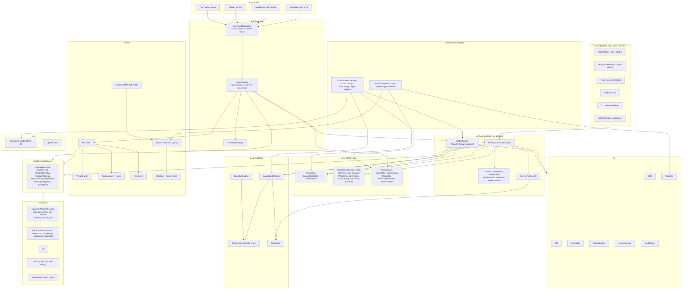
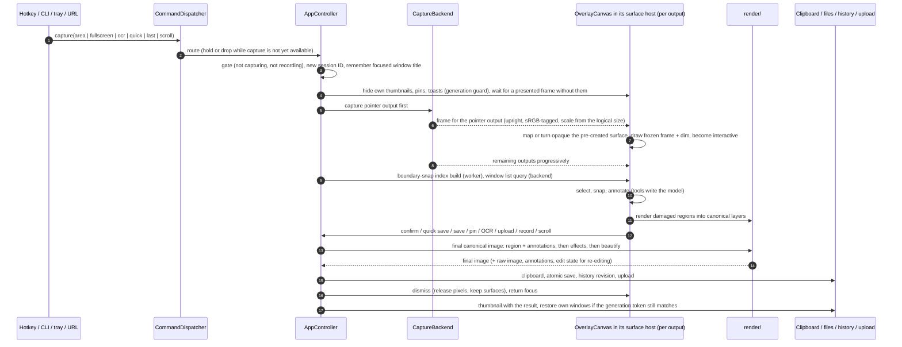
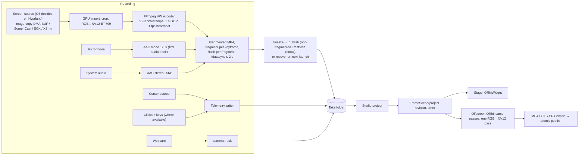

<!--
SPDX-FileCopyrightText: 2026 The AriadShot Authors
SPDX-License-Identifier: GPL-3.0-only
-->

# 01. Architecture Overview

Part of the [AriadShot technical specification](README.md). Decisions and their rationale:
[ADR 0001](../adr/0001-architecture-and-stack.md), [ADR 0002](../adr/0002-foundation-and-workflow.md).

## 1. Outcome

A user who knows MacShot installs AriadShot on Hyprland, on macOS, and with documented limits on KDE Plasma, X11 and
GNOME, and finds the same product: the same capture flows, overlay, 19 annotation tools with the same defaults and
shortcuts, toolbars, popovers and pixel geometry, the same editor, history, pin, thumbnail, OCR, translation,
redaction, scroll capture, recorder and studio video editor, and the same settings. Where an operating system forbids
an exact behaviour, AriadShot says so in the interface and offers the closest legal equivalent, recorded as a
deviation.

MacShot's product is dominated by custom-drawn UI and deterministic image logic: about two thirds of its parity rows are
pure drawing, layout, state machines and algorithms. The architecture therefore optimises for porting MacShot's custom
views structurally and rendering them identically everywhere, and it isolates the platform-dependent third (capture,
window discovery, global input, overlay placement, clipboard ownership) behind narrow interfaces.

## 2. Constraints that shape the architecture

1. **Fidelity is the product.** Constants, defaults, strings, geometry and state machines come from MacShot source at
   `b4d4f3a`. Invented behaviour is a defect. Known upstream defects are fixed, not copied, and each fix is a
   deviation-register entry ([14 §5](14-gates-and-milestones.md#5-initial-deviation-register)).
2. **Linux Wayland is first class.** Hyprland is the reference platform. Wayland forbids passive global input
   capture, client-side positioning of normal windows and (on GNOME) a window list, and it makes clipboard ownership
   cooperative. The architecture treats each of those as a capability to probe, not an assumption.
3. **macOS must work well** and is a reference target contingent on gate G7. The minimum supported version is macOS 14
   (DEV-27), claimed only while macOS 14 is actually tested.
4. **Licence.** MacShot grants GPLv3 without an "or later" clause, so the combined work is GPL-3.0-only. Model weights
   must be permissively licensed, not only their inference code.
5. **Privacy.** Zero telemetry; local-first processing; network only for user-initiated upload, translation, update
   checks and consented model downloads ([11](11-security-privacy.md)).
6. **The user's configuration is respected.** AriadShot never assumes it owns a key chord on Wayland and never edits
   the user's compositor configuration without an explicit user action ([08](08-platform-integration.md)).
7. **Parity is pinned** to MacShot commit `b4d4f3a`. Upstream changes are reviewed per AriadShot release and adopted
   only by a deliberate re-baseline.

## 3. Platforms and support tiers

| Tier | Platforms | Promise |
| :--- | :--- | :--- |
| Reference | Hyprland (wlroots-family compositor with Hyprland protocols) | Full parity with MacShot, measured every milestone on the reference host and in a nested Hyprland |
| Reference target, contingent | macOS 14 and later | The same parity bar, at most one milestone behind Hyprland. Contingent on gate G7 and on the macOS feature gates ([14 §3](14-gates-and-milestones.md#3-platform-feature-gates)). Without them macOS may claim only "builds, launches, captures, copies" |
| Supported, contingent | Sway and other wlroots compositors, KDE Plasma 6, X11 (i3, Xfce, KDE X11, GNOME Xorg) | Full parity except the capability differences of [08 §2](08-platform-integration.md), claimed only for what CI measures in nested KWin, headless Sway and Xvfb/Xephyr |
| Best effort | GNOME Shell on Wayland (Mutter), Flatpak builds | Capture, annotate, editor, history and recording through portals. Every gap is registered; nothing is claimed beyond what a GNOME 48+ VM measures |

Windows, web and mobile clients are out of scope.

## 4. The five architectural invariants

These hold in every module and on every platform. The module rules that enforce them are in
[02](02-modules-and-interfaces.md).

1. **Portable code never includes platform headers.** `core/`, `render/` and `ui/` see no platform API. Everything that
   differs by desktop goes through a `platform/` interface, and the capability registry records which interface
   functions work in this session. UI code asks "can I snap to windows here?"; it never checks the desktop or
   compositor name.
2. **One pixel source, under contract.** Every pixel that leaves the application (clipboard, file, upload, history,
   pin, drag-out) is a canonical image made by `render/`. Every surface displays canonical images and never re-renders
   annotations itself. The studio's exported frames come from the same `FrameScene` function, shaders and pass list as
   its stage. Both contracts are tested, not assumed ([03](03-rendering-contracts.md)).
3. **MacShot's class boundaries are kept where they carry behaviour**: the overlay/editor subclass relationship with its
   override points, the overlay's delegate output API, the two confirm routes, dismiss versus teardown. They live in
   host-agnostic view objects, so a surface host can be swapped without touching them.
4. **Resident daemon.** One process starts at login (on user opt-in) and owns the tray, hotkeys, clipboard selections
   and pre-warmed overlay surfaces. It holds no screenshot pixels while idle.
5. **Two Wayland connections with fixed ownership.** Qt's connection serves surfaces, text input, cursor shape and
   pointer warp. AriadShot's own `WaylandSession` serves capture, data-control, toplevel export, synthetic input and
   the Hyprland shortcut fallback, on its own thread ([04 §3](04-capture-and-overlay.md)).

## 5. Component architecture

Two families of surfaces exist, and the split is deliberate:

- **Overlay-class surfaces** must float above other windows, cover panels or be placed by the application: the
  capture overlay (one per output), floating thumbnail, pin windows, upload toast, history panel, countdown, recording
  HUD, webcam bubble and scroll-capture preview. They are view objects shown through a surface host
  ([04 §5](04-capture-and-overlay.md)). Popovers and right-click menus opened inside an overlay are chrome views drawn
  inside the same surface, so no popup surface is needed.
- **Ordinary windows** use Qt Widgets: the editor frame, Settings, the OCR window, dialogs, the audio-merge panel, the
  export progress window and the studio frame. Menus opened from ordinary windows may be Qt menus. On Linux the
  standard controls are drawn by the `AriadStyle` proxy style (DEV-38); on macOS by the native style.

## 6. Processes

| Process | Built from | Role |
| :--- | :--- | :--- |
| `ariadshot-daemon` | `src/app/` (+ every linked module) | The resident application: tray or status item, hotkeys, command dispatcher, overlays, windows, recorder, studio, stores. One instance per user session ([08 §5](08-platform-integration.md)) |
| `ariadshot` | `src/cli/` | A small command-line client without Qt linkage. It forwards a command to the daemon's control socket and exits with the daemon's result, so shell-triggered captures do not pay Qt start-up. If no daemon runs, it starts one |
| Input helper (Linux, opt-in) | `src/backends/` (M3) | Optional, separately installed by the user, which delivers click and key events for recording telemetry and live overlays on Wayland. Its process boundary and privilege model are fixed by an ADR in M3; the privacy contract is in [11 §6](11-security-privacy.md) |
| Sparkle helpers (macOS) | Sparkle 2 framework | The updater's XPC services inside the app bundle (M5) |

The daemon starts at login only when the user enabled launch at login (ST-06): an XDG autostart entry on Linux,
`SMAppService` on macOS. It is otherwise started by the CLI, the URL handler, the desktop entry or a file open.

## 7. Threads

| Thread | Owns | Rules |
| :--- | :--- | :--- |
| GUI thread | Qt event loop, every `QObject` with a GUI parent, view objects, surface hosts, windows, the Qt Wayland connection, QtDBus calls, `QNetworkAccessManager` | Never blocks: no synchronous file, network, encode or model work longer than one frame. Presentation work only |
| `WaylandSession` thread | AriadShot's own `wl_display`, its event queue, capture sessions, data-control sources, virtual pointer, toplevel export, Hyprland shortcut fallback | Uses no Qt GUI classes. Dispatches with `wl_display_prepare_read` / `read_events` / `dispatch_pending`. Communicates with the GUI thread only through queued signals or lock-protected queues ([04 §3](04-capture-and-overlay.md)) |
| Worker pool | Pixel work (boundary-snap index, mesh gradients, blur, effects, encode, history writes), parsing of untrusted input | `QtConcurrent` or dedicated `QThread` workers, cancellable, results delivered by queued signal. Pixel loops run only in the audited pixel module of `render/` |
| Media threads | Recorder clock and heartbeat, encoder, muxer, PipeWire stream loops, decoder, studio export | Owned by `media/`. The recorder never waits on the GUI thread; the writer's watchdogs run on their own timers ([05](05-recording-and-studio.md)) |
| ML worker | Model inference (OCR, masks, detection, transcription) | Owned by `ml/`. Inference is cancellable and never runs on the GUI thread |

Cross-thread ownership of every object is stated in its header comment. A `QObject` is moved to a thread only by the
component that owns that thread.

## 8. Data flows

### 8.1 Capture → overlay → annotate → output

The ordering rules of steps 4–8 are the capture ordering contract ([04 §4](04-capture-and-overlay.md)). The rendering
rules of steps 12–15 are the still-image contract ([03 §2](03-rendering-contracts.md)).

### 8.2 Record → edit → export

The recorder, writer states and studio pipeline are specified in [05](05-recording-and-studio.md).

## 9. Launch sequence

The daemon follows MacShot's launch order (SH-02, `macshot/AppDelegate.swift`): settings migrations, save-failure
toast wiring, cleanup sweepers on a background queue, history initialisation with orphan pruning, the updater
(M5), menus, the tray or status item, hotkeys, audio pre-warm for the capture sound, display, workspace and keyboard
layout observers, the capability probe (which replaces MacShot's permission check on Linux), and overlay pre-warm.
Capture-class requests that arrive before the capability registry resolves are held and replayed in order, or dropped
with an error when capture turns out to be unavailable ([08 §4](08-platform-integration.md)).

## 10. Decision map

| Concern | Decision | Specified in |
| :--- | :--- | :--- |
| Language and toolkit | C++20, Qt 6 (minimum 6.8 LTS), Qt Widgets for ordinary windows; Objective-C++ and a small Swift module on macOS | [02](02-modules-and-interfaces.md), [13](13-build-ci-release.md) |
| Canvas and chrome | Host-agnostic C++ view objects ported from MacShot's views; own canvas text control on `QTextDocument`/`QTextLayout` | [04 §5](04-capture-and-overlay.md), [06 §3](06-annotation-model-and-formats.md) |
| Overlay host | H1 `QWidget` + `layer-shell-qt` by default; H2 `QQuickWindow` + `layer-shell-qt`; H3 hand-written layer-shell client; `NSPanel`, X11 override-redirect and GNOME fullscreen hosts [GATE G1] | [04 §5](04-capture-and-overlay.md), [14 §2](14-gates-and-milestones.md) |
| Still renderer | `QPainter` raster on `QImage`, plus own blur, calibrated shadows, 3×3 mesh gradients and effect LUTs | [03](03-rendering-contracts.md) |
| Studio compositor | `QRhi` (Vulkan explicit on Linux with an OpenGL fallback, Metal on macOS), one shader set | [03 §3](03-rendering-contracts.md), [05](05-recording-and-studio.md) |
| Linux capture | `ext-image-copy-capture-v1` per output, `wlr-screencopy` fallback, portals on KDE/GNOME, XShm on X11 [GATE G2] | [04](04-capture-and-overlay.md) |
| macOS capture | ScreenCaptureKit, sequential per display, pointer display first | [04](04-capture-and-overlay.md) |
| Recording | FFmpeg on both OSes; Hyprland source chosen between image-copy DMA-BUF and ScreenCast + PipeWire [GATE G6] | [05](05-recording-and-studio.md) |
| ML | Apple frameworks on macOS; ONNX Runtime, zxing-cpp, CTranslate2 and whisper.cpp on Linux | [09](09-ml-services.md) |
| Storage | JSON documents, schema-versioned, written atomically; revision-directory history; keyring secrets with a visible 0600 fallback | [06](06-annotation-model-and-formats.md), [07](07-storage-history-settings.md) |
| Hotkeys | GlobalShortcuts portal first; Hyprland protocol fallback; X11 `XGrabKey`; Carbon on macOS; CLI everywhere | [08 §3](08-platform-integration.md) |
| IPC | `QLocalServer` control socket with line-delimited JSON; Qt-free CLI | [08 §5](08-platform-integration.md) |
| Licence | GPL-3.0-only, `PROVENANCE.md` for every reused MacShot asset | [13 §8](13-build-ci-release.md) |
| macOS distribution | Ad-hoc signed, never notarized; Sparkle with EdDSA only | [13 §7](13-build-ci-release.md) |

## 11. Top risks

| # | Risk | Mitigation | Proven in |
| :-: | :--- | :--- | :--- |
| R1 | IME (fcitx5, Vietnamese Telex, CJK) fails in the overlay's canvas text control | Qt's `QT_IM_MODULE=fcitx` path bypasses the compositor's `text-input-v3`; G1 step 4 tests both paths; fallback to a pop-up, then the editor window (DEV-21) | G1 |
| R2 | QWidget windows misbehave on `layer-shell-qt` | G1 with predefined outcomes: H2 at 1–2 weeks, H3 at 4–6 weeks | G1 |
| R3 | Hotkey-to-overlay latency misses its budget | pointer output first, pre-created surfaces, dormant-mapped variant, benchmark harness | G1, G8 |
| R4 | CPU canvas misses the frame budget at 4K or when zooming | damage-only repaint, per-annotation raster caches, texture presentation through H2 | G1, M1 |
| R5 | Passive click and key telemetry is unavailable on Wayland | cursor from image-copy cursor sessions or portal metadata; clicks and keys from macOS, X11 or the opt-in helper; dependent studio options disabled with a reason (DEV-24) | M3 |
| R6 | GNOME overlay parity is impossible with public protocols | fullscreen toplevel with activation tokens; portal behaviour measured in a VM; disclosure (DEV-26) | M5 |
| R7 | `QRhi` changes between Qt minors (needs `Qt6::GuiPrivate`) | compositor behind an interface; Qt minor pinned per release; portable GLSL | G5, M4 |
| R8 | Apple-specific looks cannot be reproduced exactly on Linux | fitted LUTs, icon approval sheet, registered substitutions (DEV-02 to DEV-05) | M2 |
| R9 | KWin restricts image-copy capture | run-time probe; ScreenCast with restore tokens | M2 |
| R10 | C++ memory-safety defects in a long-running daemon | sanitizers, fuzzing, hardening, bounded parsers; a Rust parser library if fuzzing keeps finding defects | continuous |
| R11 | MacShot keeps evolving | parity pinned to `b4d4f3a`; upstream diffs reviewed per release | continuous |
| R12 | Uploads need AriadShot's own keys and OAuth client | "not configured" state; user-supplied keys (DEV-31) | M2 |
| R13 | The two Wayland connections stall each other | dedicated dispatch thread; stress test under capture load | G4 |
| R14 | macOS cannot be tested at both ends of the supported range | owner's Mac on macOS 26 plus a macOS 14 VM runner; otherwise the minimum narrows | G7 |
| R15 | Recording cannot exclude AriadShot's own surfaces on Wayland | per-desktop strategy (DEV-22, DEV-23) | M3 |
| R16 | A licence obligation is missed | `PROVENANCE.md`, model catalogue with weights licences, per-package checklist, codec review as a release gate | M5 |
| R17 | The image-copy recording path drops frames or costs too much CPU | G6 measures both candidates; the better one becomes primary | G6 |

Only three results reopen the stack decision: the still rendering contract (G3) fails in a way specific to `QPainter`;
the studio contract (G5) fails on both Vulkan and Metal while an equivalent wgpu spike passes; or fuzzing in M1–M2
finds memory-safety defects in AriadShot's parsers faster than they can be fixed. The first response to the third is
moving the untrusted-input parsers into a small Rust static library with a C ABI, not a stack change.

## 12. Non-goals

- Byte compatibility with MacShot's files (settings plist, history index dates, `cursor.mstl`, project JSON).
  AriadShot defines its own versioned formats with the same fields and semantics (DEV-28). Importing a MacShot settings
  export is a possible later convenience.
- Windows support, web or mobile clients, AriadShot-operated cloud services, telemetry, and features MacShot lacks
  (colour management, JPEG XL, NER redaction, LLM translation) before 1.0.
- Reproducing MacShot's known defects.
- The pre-Studio video editor layout; the target is the v4.4 Studio editor in the pinned source.
- Pixel identity between Linux and macOS. Each platform meets the rendering contract and the MacShot corpus within its
  tolerance class ([12 §4](12-testing-strategy.md)).
- macOS 12.3–13.x (DEV-27).
